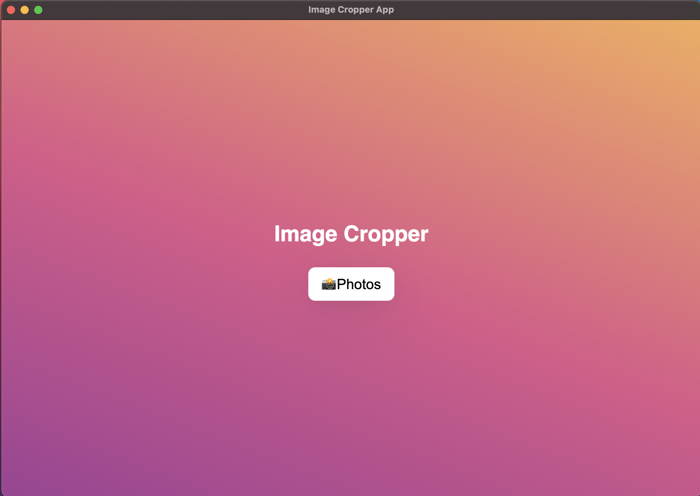

# Electron Image Cropper

Simple electron and React App, based on electron-react-boilerplate that allows the user to choose a file, crop and zoom and save.

---

## Running locally

1. install dependencies by running `yarn`

2. launch app by running `yarn start`

---

## Build for desktop

run `yarn package`

 

---

Once app is open, click on Photos

 
Crop photo to desired size

 
Photo is now cropped and saved to your computer

